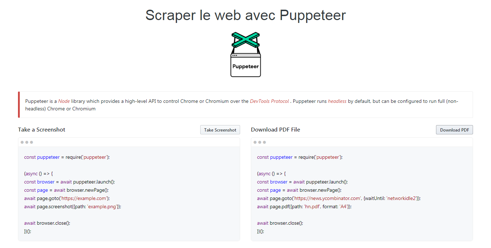

# Puppeteer-app

> App made by Node.js and Express to demonstrate how to generate screenshots and PDF using Puppeteer

## Preview



## Install dependencies

```bash
npm install
```

## Run it

```bash
node app.js
```

Navigate to `http://localhost:3000/` and enjoy your App !

## API References

Puppeteer : https://pptr.dev/